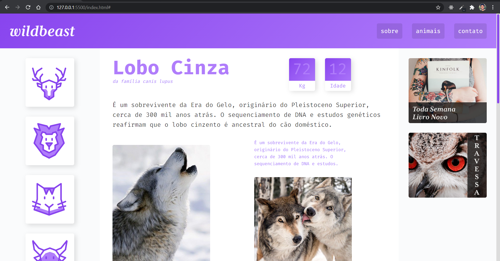

# WildBeast - site responsivo com CSS grid layout

### Este site foi inteiramente construído através de propriedades do "display: grid" no CSS. As explicações, instruções e dicas foram obtidas no curso de CSS Grid Layout da [Origamid](https://origamid.com).

 

### Recomendo a todos que queiram ter uma base sólida de como e quando usar o grid layout.

 

### Abaixo segue uma captura de tela do resultado final:

